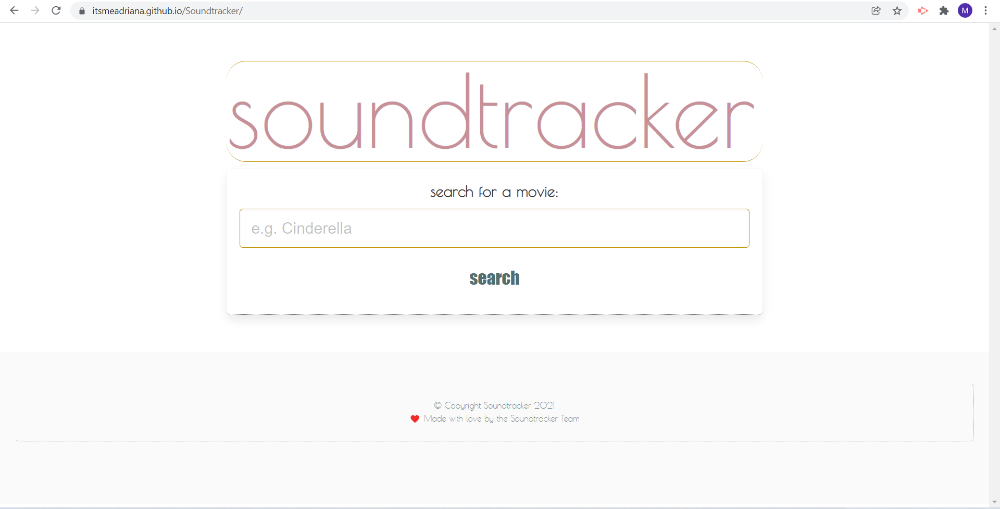

# Soundtracker

# Purpose:

This website allows users to search for a movie and returns its soundtrack list, as well as lyrics and a YouTube video (as available) for each track. By consolidating all of this information into one place, soundtracker eliminates the need to use Shazam in the middle of watching a movie or to scour Google and YouTube for each song.

## USER STORY:

- AS A user I WANT to know what songs are playing in the movie I’m watching
- SO THAT I can listen to them on my own

## ACCEPTANCE CRITERIA:

- GIVEN I am searching for a movie
- WHEN I type in a movie title
- THEN I am presented with search results (list of movies with that title)
- WHEN I click on the movie search result
- THEN I am given the movie’s soundtrack track list
- WHEN I click on an individual track
- THEN I will get a modal with a link to the song lyrics

## How to Use

1. See the live website here: https://itsmeadriana.github.io/Project1/
2. Alternatively, you may clone this repo, download the .zip file, and open "index.html" in your favorite browser!

## Website Preview

[Click Here To Use Soundtracker Now!](https://itsmeadriana.github.io/Soundtracker/)

# Roles and Tasks:

- Front-end: Adriana and Megha
- Back-end: Matthew and Vincent

# Technology Used:

- HTML
- CSS with Bulma style library
- JavaScript with jQuery

# APIs Used:

- [RapidAPI IMDB API](https://rapidapi.com/apidojo/api/imdb8) 
- [Happi Music API](https://happi.dev/docs/music)
---
© 2021 by the Soundtracker Team
❤️ Made with love by Adriana Nieves, Vincent Rivera, Megha Samala, and Matthew Sievers
